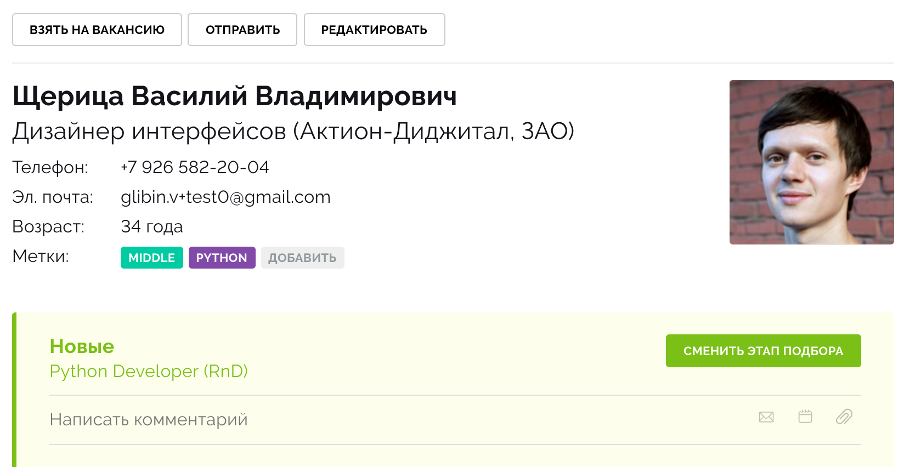
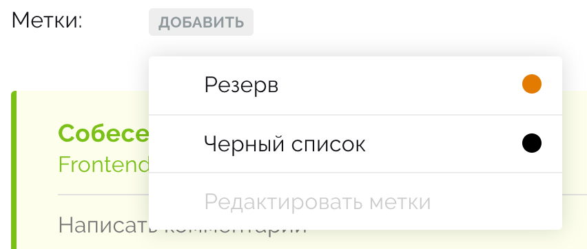
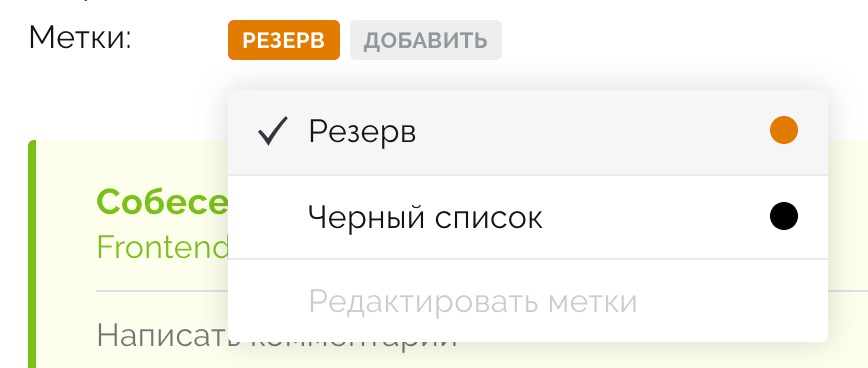
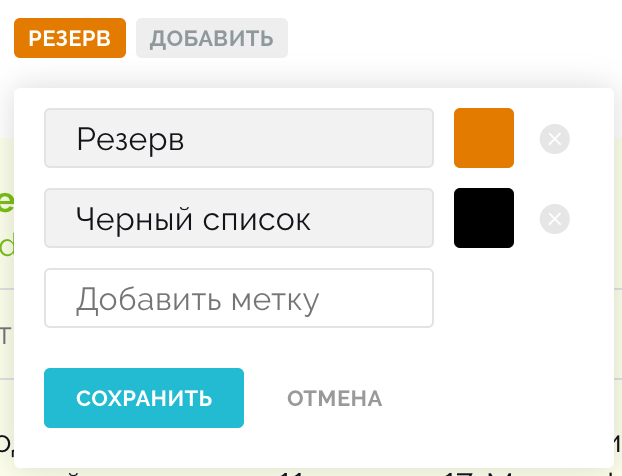
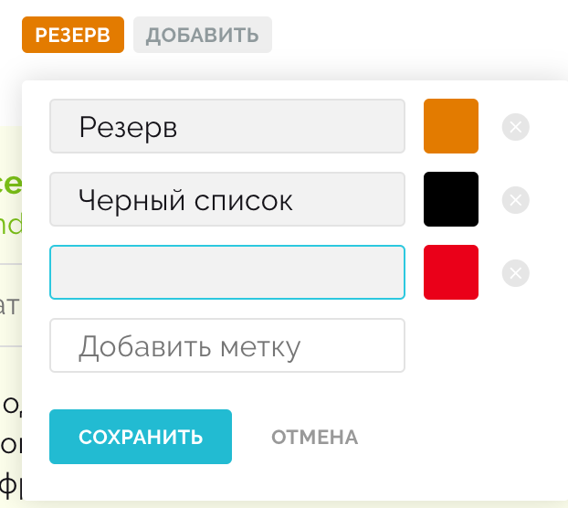
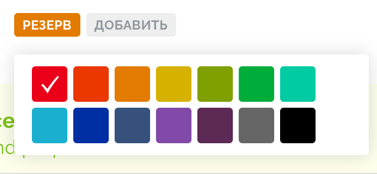
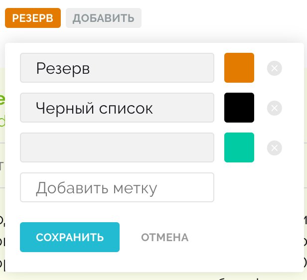

# Тестовое задание

Необходимо реализовать контрол управления метками кандидата на Vue JS. Сходство стилей является опциональной частью, но будет плюсом. Для задания нужно написать простой бэкенд управления метками на Python.

Также можно запросить тестовый доступ, чтобы посмотреть механику вживую: [Хантфлоу](https://huntflow.ru/) (при создании организации указать, что это доступ для выполнения тестового задания).

## Интерфейс

Изначально у нас не выставлено никаких меток:

При клике на "Добавить" появляется выпадающий список с доступными метками + последний пункт "Редактировать метки":

Далее мы можем выбрать метки (при клике ставится галка на текущей + появляется бабл):

При нажатии на "Редактировать метки" появляется интерфейс управления метками:

Можно добавлять/удалять метки (при клике в поле "Добавить метку" появляется новая метка с фокусом в ней).

Выбор цвета опционален для тестового задания, но будет плюсом (при клике на цвет появляется возможность выбора цвета, клик по цвету выбирает его):

